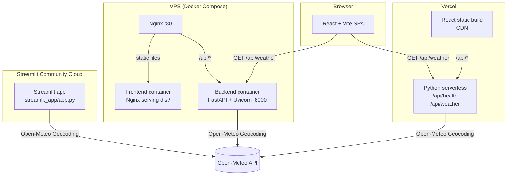

# MADA Demo — Deployment Showcase

A small, clean project that demonstrates the same application deployed three different ways:

| Method | Stack |
|---|---|
| **Vercel** | React (Vite) + Python serverless functions |
| **Streamlit Community Cloud** | Pure Python, runs in a browser |
| **VPS (Docker + Nginx)** | React + FastAPI + Docker Compose |

---

## 1 — Project overview

The app has two features:

- **Animated dice roller** — rolls two dice with a smooth tumbling animation, shows each result and the total.
- **City temperature lookup** — calls the free [Open-Meteo](https://open-meteo.com/) API (no key required) and displays the current temperature and weather condition.

The React frontend never calls Open-Meteo directly. It sends requests to `/api/weather`, which the Python backend handles.

---

## 2 — Architecture



### Request flow (React + FastAPI)

```
Browser  →  GET /api/weather?city=London
         →  [Vite proxy in dev / Nginx in prod / Vercel router in cloud]
         →  FastAPI /api/weather
         →  Open-Meteo Geocoding API  (city → lat/lon)
         →  Open-Meteo Forecast API   (lat/lon → temperature)
         →  JSON response back to React
```

---

## 3 — Repository structure

```
project-root/
├── api/                      # Vercel serverless functions (Python)
│   ├── health.py
│   └── weather.py
├── backend/                  # FastAPI application
│   ├── main.py
│   ├── requirements.txt
│   └── Dockerfile
├── frontend/                 # React + Vite application
│   ├── src/
│   │   ├── components/
│   │   │   ├── Die.tsx
│   │   │   ├── DiceRoller.tsx
│   │   │   └── WeatherLookup.tsx
│   │   ├── hooks/
│   │   │   └── useWeather.ts
│   │   ├── types/
│   │   │   └── weather.ts
│   │   ├── App.tsx
│   │   ├── App.css
│   │   └── main.tsx
│   ├── index.html
│   ├── package.json
│   ├── tsconfig.json
│   ├── vite.config.ts
│   └── Dockerfile
├── shared/                   # Python weather service (reused by backend + Streamlit)
│   ├── __init__.py
│   └── weather_service.py
├── streamlit_app/            # Streamlit version
│   ├── app.py
│   ├── requirements.txt
│   └── .streamlit/
│       └── config.toml
├── nginx/
│   ├── nginx.conf            # VPS reverse proxy config
│   └── spa.conf              # React SPA fallback (used inside frontend container)
├── docker-compose.yml        # VPS deployment
├── vercel.json               # Vercel deployment
├── requirements.txt          # Root-level — Vercel Python functions only
├── .env.example
├── .gitignore
└── README.md
```

---

## 4 — Local setup

### Prerequisites

| Tool | Minimum version | Install |
|---|---|---|
| Python | 3.11 | [python.org](https://python.org) |
| Node.js | 20 LTS | [nodejs.org](https://nodejs.org) |
| Docker Desktop | latest | [docker.com](https://docker.com) |

### Create a Python virtual environment (recommended)

```bash
python -m venv .venv

# Windows
.venv\Scripts\activate

# macOS / Linux
source .venv/bin/activate
```

---

## 5 — React + FastAPI (local development)

### Install dependencies

```bash
# Backend
pip install -r backend/requirements.txt

# Frontend
cd frontend && npm install && cd ..
```

### Run the backend

```bash
# From the project root
uvicorn backend.main:app --reload --port 8000
```

The API is now available at `http://localhost:8000`.  
Interactive docs: `http://localhost:8000/docs`

### Run the frontend

```bash
cd frontend
npm run dev
```

Open `http://localhost:5173`.

Vite automatically proxies `/api/*` requests to `http://localhost:8000` (configured in `vite.config.ts`), so you do **not** need to touch CORS during local development.

### Test the API manually

```bash
curl "http://localhost:8000/api/health"
curl "http://localhost:8000/api/weather?city=Paris"
```

---

## 6 — Streamlit (local development)

```bash
pip install -r streamlit_app/requirements.txt
streamlit run streamlit_app/app.py
```

Open `http://localhost:8501`.

---

## 7 — Vercel deployment

### Why GitHub is needed

Vercel connects to a GitHub repository and re-deploys automatically whenever you push. You cannot deploy from a local folder with the free Vercel plan.

### Steps

1. Push this repository to GitHub (see §10).
2. Go to [vercel.com](https://vercel.com) → **Add New Project** → import your GitHub repo.
3. In the project settings use these values:

   | Setting | Value |
   |---|---|
   | Framework Preset | **Other** |
   | Root Directory | *(leave blank — project root)* |
   | Build Command | `cd frontend && npm install && npm run build` |
   | Output Directory | `frontend/dist` |
   | Install Command | `cd frontend && npm install` |

4. Click **Deploy**. Vercel picks up `vercel.json` automatically.

### How it works

- The React build is served from Vercel's CDN.
- Requests to `/api/health` and `/api/weather` are routed to `api/health.py` and `api/weather.py` — each runs as an isolated Python serverless function.
- The `shared/` directory is accessible to the serverless functions because it sits at the repo root.

### Environment variables

This project needs **no secret API keys**. If you add a key-based service later, add the variable in **Vercel → Project → Settings → Environment Variables**.

---

## 8 — Streamlit Community Cloud deployment

### Why GitHub is needed

Streamlit Community Cloud deploys directly from a public (or private) GitHub repository. It re-deploys on every push to the selected branch.

### Steps

1. Push this repository to GitHub (see §10).
2. Go to [share.streamlit.io](https://share.streamlit.io) → **New app**.
3. Fill in:

   | Field | Value |
   |---|---|
   | Repository | `your-username/your-repo` |
   | Branch | `main` |
   | **Main file path** | `streamlit_app/app.py` |

4. Click **Deploy**.

### Dependencies

Streamlit Community Cloud installs packages from the first `requirements.txt` it finds relative to the main file. Because our `requirements.txt` lives inside `streamlit_app/`, it is picked up automatically.

> **Important:** When prompted for the main file, always select `streamlit_app/app.py` — not any other Python file.

---

## 9 — VPS deployment (Docker + Nginx)

### Architecture

```
Internet → Nginx :80 → frontend container (React static)
                     → backend container  (FastAPI :8000) ← /api/*
```

### Before you start

1. Replace `YOUR_DOMAIN` in `nginx/nginx.conf` with your actual domain or server IP.
2. Update `ALLOWED_ORIGINS` in `docker-compose.yml` to match your domain.

### Commands

```bash
# Build all containers
docker compose build

# Start all services (detached)
docker compose up -d

# View live logs
docker compose logs -f

# Stop all services
docker compose down

# Rebuild and restart after code changes
docker compose up -d --build

# Check the health endpoint
curl http://YOUR_DOMAIN/api/health
```

### Adding HTTPS later (Let's Encrypt)

Once DNS is pointing at your server:

```bash
# Install Certbot on the VPS
sudo apt install certbot python3-certbot-nginx -y

# Obtain and install a certificate
sudo certbot --nginx -d YOUR_DOMAIN

# Certbot edits nginx.conf automatically and sets up auto-renewal
```

---

## 10 — GitHub setup

GitHub is required for Vercel and Streamlit Community Cloud because both platforms deploy directly from a repository.

```bash
# 1. Initialise the local Git repository (already done if you cloned this)
git init
git add .
git commit -m "Initial commit"

# 2. Create a repository on GitHub
#    Go to https://github.com/new and create an empty repository.
#    Do NOT initialise it with a README — you already have one.

# 3. Connect and push
git remote add origin https://github.com/YOUR_USERNAME/YOUR_REPO.git
git branch -M main
git push -u origin main
```

After the first push, both Vercel and Streamlit Community Cloud will re-deploy automatically on every future push.

---

## 11 — Common errors and troubleshooting

### CORS error in the browser

```
Access to fetch at 'http://localhost:8000/api/weather' from origin 
'http://localhost:5173' has been blocked by CORS policy.
```

**Cause:** The frontend is calling the backend directly instead of using Vite's proxy.  
**Fix:** Make sure the frontend fetch uses a relative URL (`/api/weather`, not `http://localhost:8000/api/weather`). Vite's proxy handles the redirect. The file `frontend/src/hooks/useWeather.ts` already uses a relative URL.

---

### City not found

```json
{ "detail": "City 'Londn' not found. Check the spelling and try again." }
```

**Cause:** The Open-Meteo Geocoding API returned no results.  
**Fix:** Check the spelling. The API is case-insensitive but requires a real city name.

---

### Backend import error (`ModuleNotFoundError: No module named 'shared'`)

**Cause:** You are running `python backend/main.py` directly instead of using `uvicorn`.  
**Fix:** Run from the project root with `uvicorn backend.main:app --reload`.

---

### Vercel build fails — `cd frontend && npm run build` error

**Cause:** Node version mismatch or missing `package-lock.json`.  
**Fix:** Add a `.nvmrc` file in the `frontend/` folder with `20`, or pin `"engines": {"node": ">=20"}` in `package.json`. The `vercel.json` already sets `buildCommand`.

---

### Streamlit — `ModuleNotFoundError: No module named 'shared'`

**Cause:** Streamlit Community Cloud does not run from the repo root by default.  
**Fix:** The `app.py` uses `sys.path.insert` to add the repo root. If this still fails, add a `packages.txt` file in `streamlit_app/` for any OS-level packages (not needed here).

---

### Docker Compose — port 80 already in use

```
Error: address already in use :::80
```

**Fix:** Stop whatever is using port 80 (`sudo lsof -i :80`) or change the port in `docker-compose.yml`:

```yaml
ports:
  - "8080:80"
```

---

## 12 — How requests move through the application

### Local development

```
User types "London" → clicks "Get Temperature"
  → React fetch("/api/weather?city=London")
  → Vite dev server proxy → http://localhost:8000/api/weather?city=London
  → FastAPI validates query param
  → httpx GET https://geocoding-api.open-meteo.com/v1/search?name=London
  → Gets lat=51.507, lon=-0.127
  → httpx GET https://api.open-meteo.com/v1/forecast?latitude=51.507&longitude=-0.127&current=temperature_2m,weathercode
  → Returns temperature, weathercode
  → FastAPI maps weathercode → "Partly cloudy"
  → JSON { city, country, temperature, unit, condition }
  → React renders the weather card
```

### VPS production

```
Browser → http://yourdomain.com/api/weather?city=London
  → Nginx (port 80) — matches /api/ location block
  → proxy_pass http://backend:8000
  → FastAPI (same logic as above)
  → response flows back through Nginx to browser

Browser → http://yourdomain.com/ (React app)
  → Nginx → proxy_pass http://frontend:80
  → Frontend Nginx serves dist/index.html (or any static asset)
```

### Vercel

```
Browser → https://your-app.vercel.app/api/weather?city=London
  → Vercel edge router matches /api/weather → api/weather.py
  → Python serverless function (same shared logic)
  → Open-Meteo → JSON → browser

Browser → https://your-app.vercel.app/
  → Vercel CDN serves frontend/dist/index.html
```

### Streamlit

```
User types in Streamlit text_input → presses Enter
  → Python st.button handler / text_input rerun trigger
  → get_weather_sync("London")  (asyncio.run under the hood)
  → same Open-Meteo calls as FastAPI backend
  → st.metric renders temperature in the Streamlit page
```
